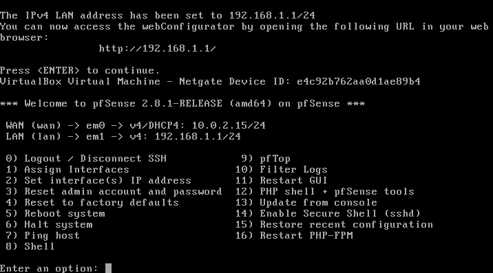
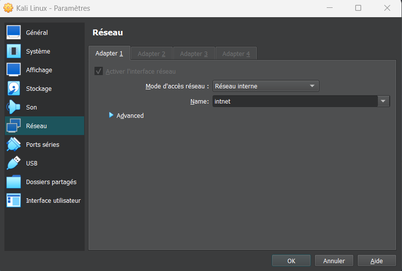
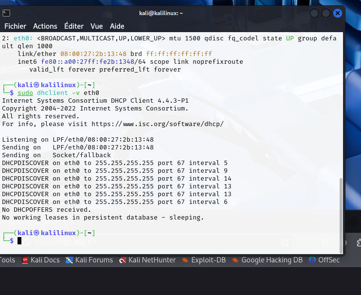
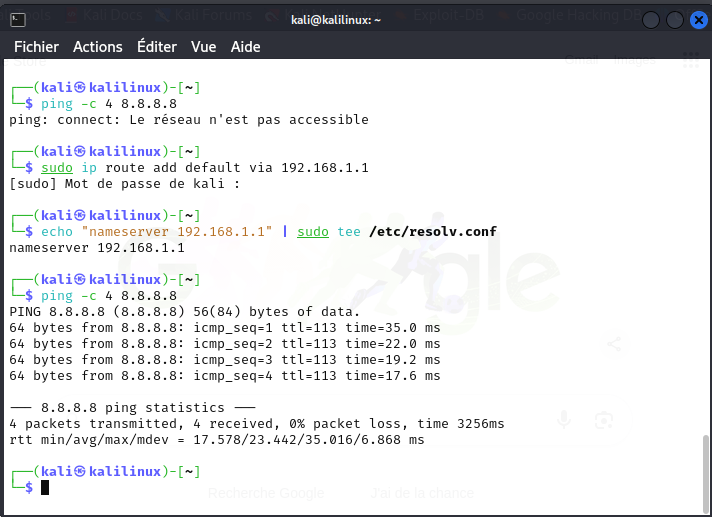
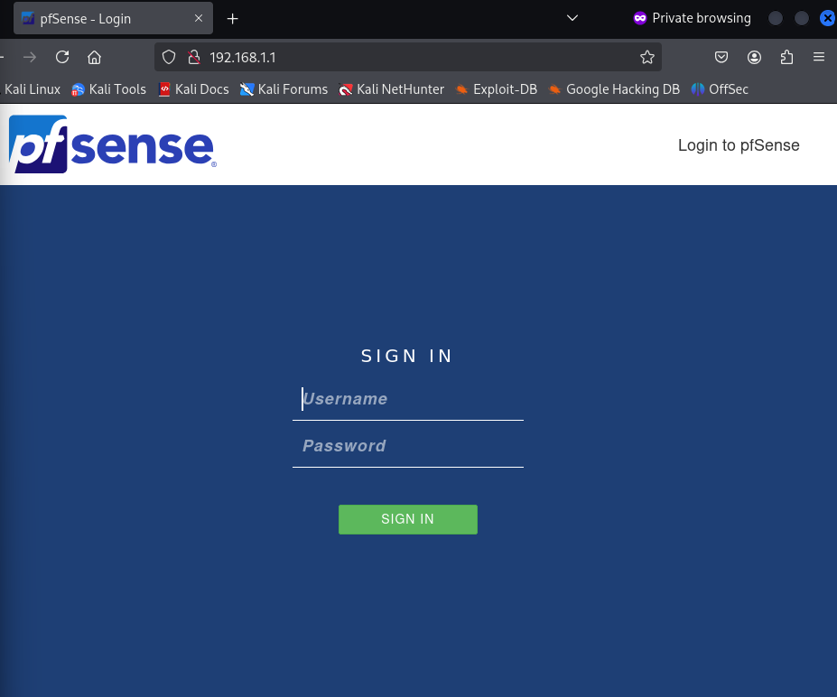
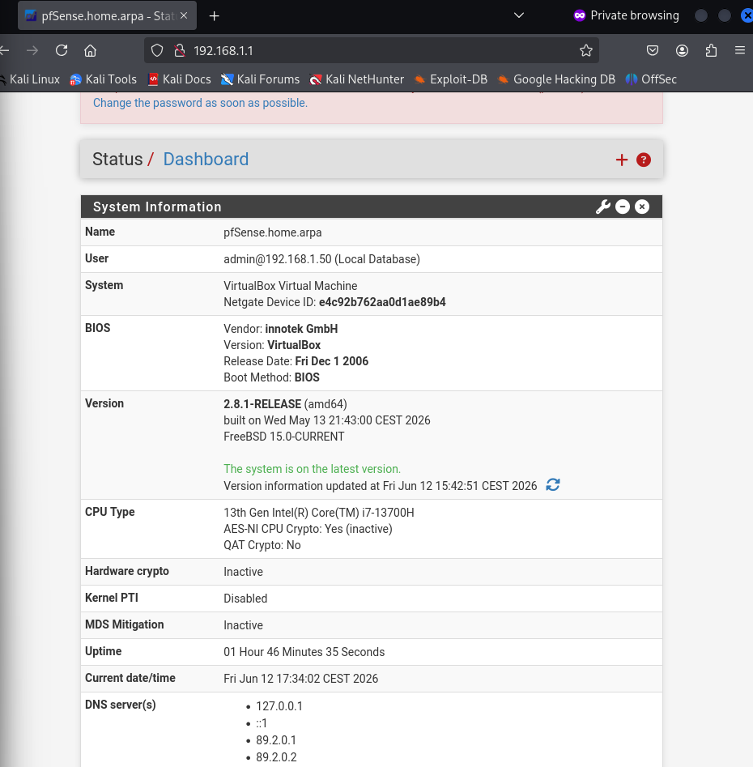
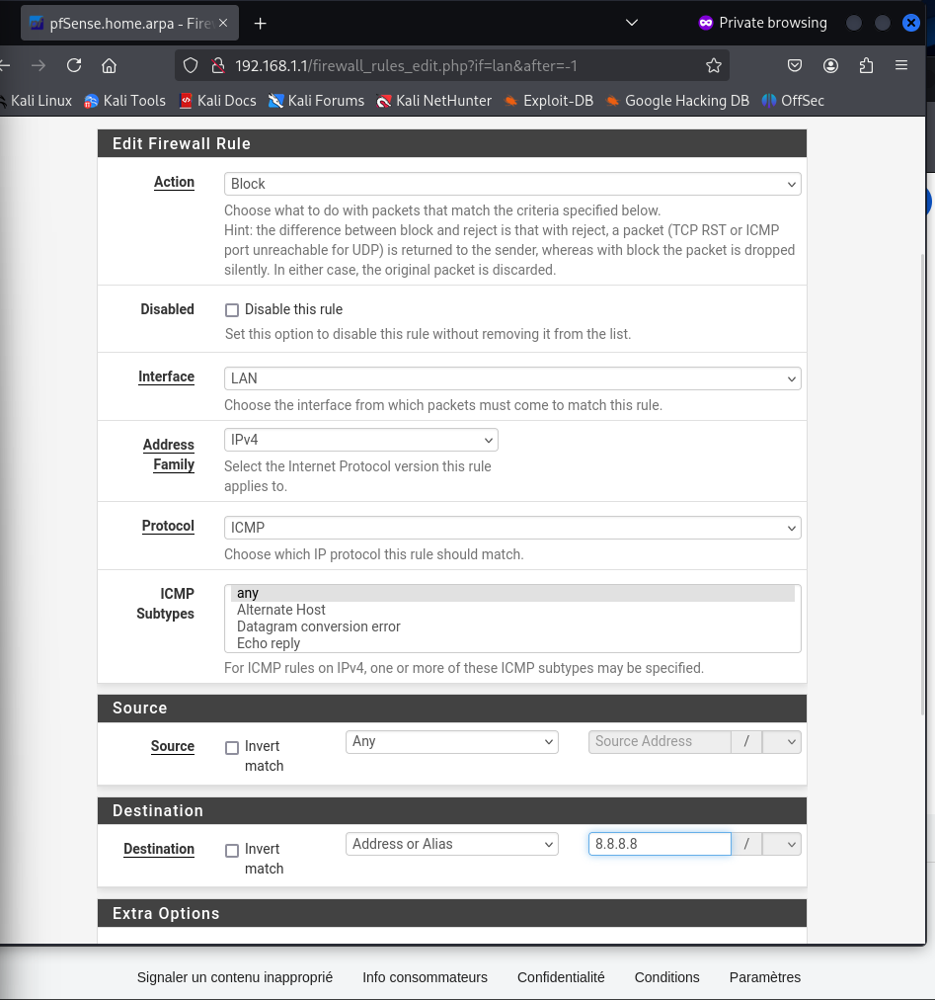
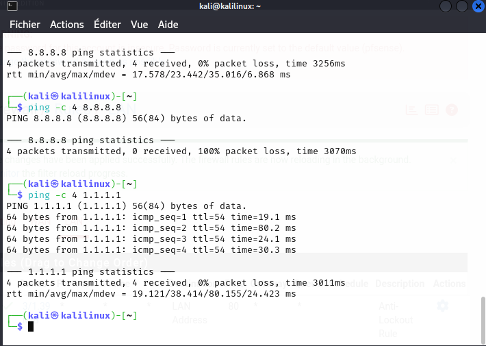

# 🛡️ Projet : Mon Labo de Cybersécurité (pfSense & Kali Linux)

L'objectif de ce projet est simple : **savoir mettre en place un pare-feu (firewall) de A à Z et comprendre concrètement comment ça fonctionne.**

## 1. L'Architecture du Laboratoire

Pour expérimenter sans casser mon propre réseau physique, j'ai tout virtualisé sur VirtualBox en créant 2 VM :

* **Le Pare-feu (pfSense) :** C'est le cœur du projet. Il fait office de routeur et de garde-frontière avec deux cartes réseau :
  * **WAN :** La patte connectée à Internet (via le NAT de VirtualBox, IP `10.0.2.15`).
  * **LAN :** Mon réseau privé et isolé, que j'ai nommé `monLab` (IP `192.168.1.1`).
* **Le Client (Kali Linux) :** C'est ma machine de test. Elle est enfermée dans le réseau LAN et dépend entièrement du pare-feu pfSense pour communiquer avec l'extérieur.

## 2. Debogage

J'ai évidemment rencontré quelques petit problèmes. Voici comment j'ai construit et debuggé mon labo étape par étape.

### Étape A : Le problème de branchement (vSwitch)
Au début, ma Kali ne communiquait pas du tout avec le pare-feu. 
* **Mon diagnostic :** En regardant la configuration de la VM, j'ai vu qu'elle était en mode NAT par défaut. Elle cherchait à sortir directement sur Internet au lieu de passer par mon routeur pfSense.
* **Ma solution :** J'ai modifié les paramètres réseau de Kali dans VirtualBox pour la forcer sur le "Réseau interne" (`intnet`).

### Étape B : Problème avec le serveur DHCP 
Une fois branchée sur le bon réseau, ma machine aurait dû recevoir une adresse IP automatiquement.
* **Le problème :** En lançant la commande `dhclient`, les requêtes `DHCPDISCOVER` tournaient en boucle sans jamais recevoir d'offre (`No DHCPOFFERS received`).
* **Ma solution (Le plan B) :** Au lieu de rester bloquée, j'ai pris le contrôle en configurant une **IP statique**. C'est une étape clé pour comprendre comment on force l'identification d'une machine sur un réseau.

### Étape C : Routage
J'avais désormais une adresse IP fonctionnelle et je pouvais parler à mon pare-feu en local. Pourtant, impossible d'accéder au reste du monde ou de pinger Internet. Mon terminal me renvoyait systématiquement l'erreur : ping: connect: Le réseau n'est pas accessible.

Ma réflexion : Avoir une IP, c'est bien pour parler à ses voisins en local. Mais pour aller sur Internet, la machine doit connaître la porte de sortie (la passerelle) et avoir un serveur DNS pour traduire les noms de domaine.

Ma solution : J'ai ajouté une route par défaut pointant vers pfSense et j'ai configuré le résolveur DNS directement dans le terminal.

### Étape D : Le blocage du navigateur (HSTS)
Le réseau était fonctionnel, mais Firefox refusait de m'afficher l'interface d'administration de pfSense, indiquant un risque de sécurité (Unable to connect).

Le diagnostic : Firefox (via le mécanisme de sécurité HSTS et son cache) forçait la connexion en HTTPS (port 443), alors que mon pare-feu m'attendait en HTTP simple (port 80).

La solution : L'utilisation d'une session de navigation privée m'a permis d'ignorer le cache du navigateur et de me connecter sans encombre avec les identifiants d'usine.

3. Comprendre le filtrage (Firewall Rules)
Pour valider mon objectif et comprendre comment le firewall agit concrètement sur les flux, j'ai créé ma première règle de sécurité (Stateful Firewall).

Mon objectif : Bloquer le Ping (ICMP) spécifiquement vers le serveur DNS de Google (8.8.8.8), mais laisser tout le reste du trafic fonctionner normalement.

Dans pfSense, les règles sont lues de haut en bas. Dès qu'un paquet correspond, l'action est appliquée. J'ai donc créé une règle d'interdiction (Block / ICMP / Destination 8.8.8.8) que j'ai placée tout en haut de ma liste sur l'interface LAN pour qu'elle soit lue en priorité absolue.

Preuve de Concept (Le Test)
Pour vérifier que ma règle fait bien son travail, j'ai lancé deux pings depuis ma machine Kali :

Ping vers 8.8.8.8 (Google) ➔ 100% packet loss. Le pare-feu intercepte immédiatement les paquets et les détruit.

Ping vers 1.1.1.1 (Cloudflare) ➔ 0% packet loss. La connexion passe sans problème, prouvant que je n'ai pas cassé le reste du réseau.

## Bilan du Projet
Ce laboratoire a été une réussite totale et m'a permis de valider concrètement mes compétences :

Démystifier le pare-feu : C'est un routeur logique qui inspecte, bloque ou autorise les paquets selon des règles strictes.

Le dépannage (Troubleshooting) : J'ai appris à ne pas paniquer devant des erreurs (Network unreachable, échecs DHCP) et à utiliser les commandes réseaux de base (ip, route, ping) pour isoler et résoudre les problèmes couche par couche.

## Auteur

Nargice Boudlal

Étudiante ingénieure à l'ESEO, souhaitant se spécialiser dans les infrastructures, systèmes, réseaux et cybersécurité.

Ce laboratoire a été réalisé dans une démarche personnelle afin de développer mes compétences pratiques en administration réseau et en sécurité des systèmes d'information.

