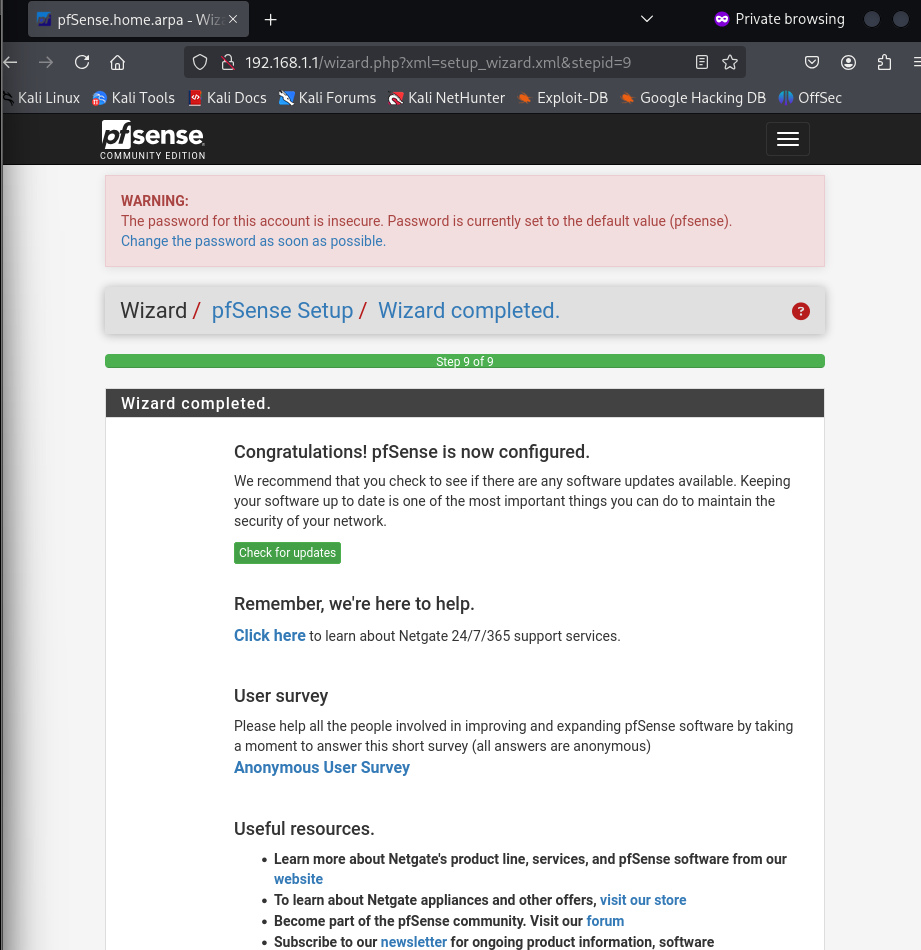

# 🛡️ Projet : Laboratoire de Sécurité Réseau (pfSense & Kali Linux)

Bienvenue dans mon laboratoire personnel. Ce projet n'est pas juste une installation de logiciels, c'est mon "bac à sable" technique. L'objectif était de construire une infrastructure réseau sécurisée de zéro, de comprendre comment router les flux et surtout, d'apprendre à résoudre les problèmes quand tout ne fonctionne pas comme prévu.

---

## 🏗️ Phase 1 : Architecture de base
Pour isoler mon environnement de test, j'ai configuré deux machines virtuelles sur VirtualBox :
* **pfSense (La tour de contrôle) :** Pare-feu avec deux cartes réseau. Le **WAN** (interface publique pour l'accès Internet) et le **LAN** (réseau privé `192.168.1.1/24`).
* **Kali Linux (Le client) :** Placé dans le segment `LAN`, isolé du monde réel par le pare-feu.

---

## 🛠️ Phase 2 : Le Journal des Opérations (Dépannage & Debug)

Le réseau, c'est souvent 20% de configuration et 80% de compréhension du "pourquoi ça bloque". Voici les étapes critiques de mon déploiement :

### 1. Le problème de "branchement" (vSwitch)
Ma machine Kali ne parvenait pas à discuter avec le pare-feu. 
* **Diagnostic :** La commande `ip a` m'a montré une IP `10.0.2.15`, ce qui prouvait qu'elle était branchée sur le NAT de VirtualBox (Internet direct) et non sur mon switch privé.
* **Résolution :** Modification des paramètres VM pour basculer sur le réseau interne.

### 2. Le DHCP en échec (Plan B)
Même sur le bon réseau, la machine n'obtenait pas d'IP. Les requêtes `DHCPDISCOVER` tournaient dans le vide.
* **Réflexion :** Plutôt que de perdre des heures sur le serveur DHCP de pfSense, j'ai repris la main manuellement (IP statique).
* **Résolution :** `sudo ip addr add 192.168.1.50/24 dev eth0`. J'ai forcé mon numéro de bureau sur le réseau.

### 3. Le mur du routage (L3)
Avec une IP, j'étais dans le réseau, mais impossible de pinger l'extérieur. Le terminal affichait "Network is unreachable".
* **Réflexion :** Une IP suffit pour discuter en local, mais pour sortir vers Internet, il faut une passerelle (Gateway).
* **Résolution :** Ajout manuel de la route par défaut (`ip route add default via 192.168.1.1`) et configuration du DNS.

### 4. Le piège du navigateur (HSTS)
Accéder à l'interface `WebConfigurator` était bloqué par Firefox (sécurité HSTS).
* **Réflexion :** Le navigateur forçait le HTTPS sur un service qui tournait en HTTP.
* **Résolution :** Utilisation d'une session de navigation privée pour by-passer le cache.

---

## 🔒 Phase 3 : Sécurité Chirurgicale (Firewalling)

Une fois le réseau stable, j'ai testé la puissance du pare-feu avec une règle de filtrage précise.

**Objectif :** Bloquer le Ping (`ICMP`) vers `8.8.8.8` (Google DNS), tout en laissant le reste du réseau naviguer librement.

* **Logique :** Placement de la règle "Block" en haut de la liste (priorité absolue).

### Preuve de Concept (PoC)
Test réalisé depuis le terminal Kali :
1. Ping vers `8.8.8.8` (Cible bloquée) : 100% perte.
2. Ping vers `1.1.1.1` (Cible autorisée) : 0% perte.

---

## 🏁 Bilan technique
Ce projet valide trois compétences clés :
1. **L'administration système :** Maîtrise des interfaces et services.
2. **Le routage réseau :** Compréhension des tables de routage et de la pile TCP/IP.
3. **La sécurité défensive :** Mise en œuvre de politiques de filtrage (Stateful Firewall) validées par des tests de pénétration.
