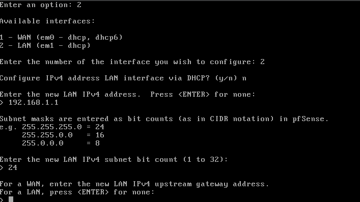
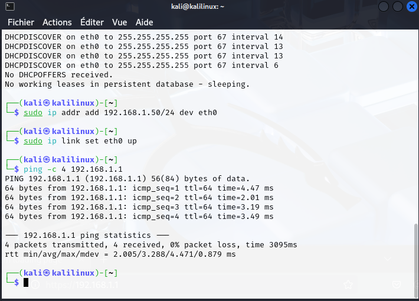

# 🛡️ Carnet de Bord : Mon Labo de Cybersécurité

Ce projet retrace la construction de mon environnement de test sécurisé. Mon objectif était de comprendre comment un pare-feu (pfSense) protège et contrôle une machine cliente (Kali Linux) dans un environnement isolé.

---

## 🏗️ Étape 1 : L'Infrastructure de Base
J'ai configuré deux machines virtuelles sur VirtualBox pour créer mon laboratoire :

1.  **pfSense (Le pare-feu) :** Deux cartes réseau. Une pour le Web (WAN) et une pour mon réseau privé (LAN).
2.  **Kali Linux (Le client) :** Isolée dans mon réseau privé `monLab`.

---

## 🛠️ Étape 2 : Le parcours du combattant (Debug & Résultats)

### Bug n°1 : La machine cliente était "à la rue"
* **Le problème :** Ma Kali n'avait pas d'adresse IP correcte. En tapant `ip a`, elle affichait une IP `10.0.2.15` (réseau NAT par défaut), preuve qu'elle était branchée à l'extérieur.
* **Le debug :** J'ai compris qu'il fallait "débrancher" le câble virtuel de la Kali du mode NAT pour le brancher sur mon switch interne `monLab`.
* **Résultat :** Après le changement dans VirtualBox et un `sudo systemctl restart NetworkManager`, elle était enfin dans mon réseau.

### Bug n°2 : Le DHCP capricieux
* **Le problème :** Même branchée au bon endroit, la Kali ne recevait pas d'IP via le protocole automatique (DHCP). Les requêtes `DHCPDISCOVER` tournaient dans le vide.
* **Le debug :** Plutôt que de perdre du temps à chercher pourquoi le serveur DHCP était têtu, j'ai utilisé une approche de "force brute" en configurant tout manuellement (IP Statique).
* **Résultat :** J'ai utilisé `sudo ip addr add 192.168.1.50/24 dev eth0`. J'ai enfin eu une IP sur le bon segment !

### Bug n°3 : Le "mur" invisible du routage
* **Le problème :** J'avais une IP, mais toujours pas d'Internet. La commande `ping 8.8.8.8` répondait "Network is unreachable".
* **Le debug :** Ma machine savait qui elle était, mais pas par quelle porte sortir pour rejoindre le monde. J'ai ajouté une route par défaut et défini le serveur DNS.
* **Résultat :** Avec `sudo ip route add default via 192.168.1.1`, j'ai enfin trouvé la porte de sortie !

### Bug n°4 : Le piège de la sécurité Firefox (HSTS)
* **Le problème :** Impossible d'afficher l'interface web de pfSense. Erreur "Unable to connect".
* **Le debug :** Mon navigateur Firefox, trop malin, forçait le HTTPS alors que mon pfSense attendait du HTTP simple.
* **Résultat :** Passage en mode "Navigation privée". Le navigateur a oublié ses restrictions, et hop, l'interface verte de pfSense est apparue.

---

## 🏁 Résultat Final
Après avoir franchi ces étapes, mon labo est parfaitement fonctionnel :

1.  **Isolation :** Ma Kali est bien dans ma zone sécurisée.
2.  **Routage :** pfSense traduit correctement les paquets (NAT) pour permettre à Kali de naviguer.
3.  **Administration :** J'ai un accès complet au WebGUI de pfSense via `http://192.168.1.1`.

---

## 🔒 Prochaine étape : La Sécurité "Chirurgicale"
Maintenant que tout est stable, je vais appliquer mes premières règles de pare-feu :
* **Bloquer le Ping :** Empêcher Kali d'envoyer des "coucous" (ICMP) vers des cibles précises.
* **Valider le blocage :** Utiliser le terminal Kali pour prouver que les paquets sont bien détruits par pfSense.

*À suivre...*
